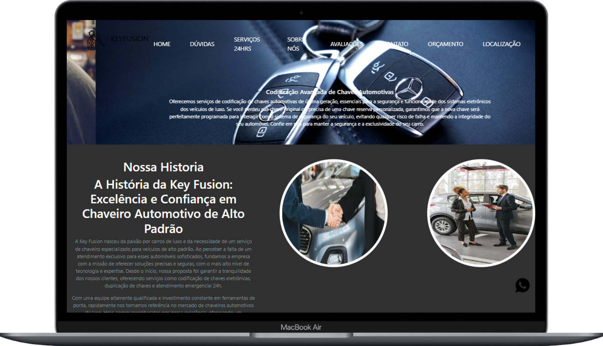

# Chaveiro Automotivo Key Fusion

## Descrição do Projeto
O Key Fusion é um site para oferecer serviços de chaveiro automotivo especializados em carros de luxo. A empresa foca em codificação de chaves, duplicação e serviços de emergência 24 horas. A ideia é proporcionar qualidade, segurança e confiança para os clientes de veículos de alto padrão.

---

## Paleta de Cores
- **#303030**: Fundo escuro
- **#FFFFFF**: Branco para texto
- **#7F8C8D**: Cor de apoio
- **#000000**: Preto para detalhes

---

## Tipografia
- **Fonte Principal**: "Chaves"
- **Fonte Secundária**: "Roboto"

---

# Checklist do Projeto

- [x] **Mínimo de 5 sessões** (desconsiderando header e footer)
  - [x] Sessão 1: Página Inicial
  - [x] Sessão 2: Área de Contato com formulário
  - [x] Sessão 3: FAQ (com no mínimo 10 perguntas e respostas)
  - [x] Sessão 4: Vídeo incorporado
  - [x] Sessão 5: Seção adicional (ex: Serviços, Produtos, etc.)

- [x] **Responsivo** (o site deve funcionar bem em diferentes dispositivos)

- [x] **Somente um item do projeto pode ser do Bootstrap**

- [x] **Navegação** entre as sessões do site
  - [x] O menu deve ser fixo

- [x] **Botão de Ação** que redireciona para o WhatsApp

- [x] **Layout Moderno**

- [x] **Carrossel** (apresentação de imagens ou conteúdo interativo)

- [x] **Rodapé** com links par

## Mockup

### Mockup Mobile
- Página inicial com vídeo de fundo e navegação fixa
- Serviços de emergência e formulário de contato otimizado para celular

### Mockup Notebook
- Carrossel de imagens e descrição dos serviços ajustados para tela maior
- Informações de contato e localização da empresa bem visíveis

---

## Informações de Contato

- **E-mail**: contato@keyfusion.com
- **Instagram**: [@keyfusion](#)
- **Telefone**: (61) 98360-2574
- **Endereço**: 111e Rue, Shawinigan, QC G9P 2T2, Canadá

---

## Link de Acesso ao Site
- [link](#)

---

## Tecnologias Utilizadas

- **HTML**: [link](#)
- **CSS**: [link](#)
- **JavaScript**: [link](#)
- **Bootstrap**: [link](#)
- **jQuery**: [link](#)
- **Google Maps**: [link](#)
- **Font Awesome**: [link](#)
- **Youtube**:[link](#)

---

